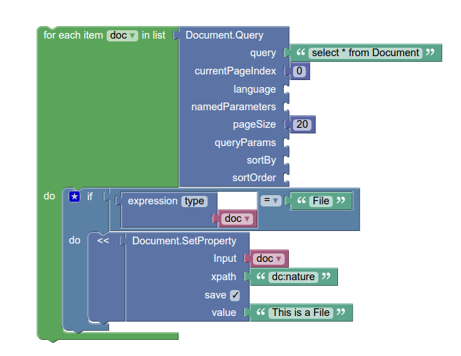

## About

This module was initially started as a prototype for building an JavaScript based Automation DSL.

The main code has now be moved to the main Nuxeo branch in [nuxeo-automation-scripting](https://github.com/nuxeo/nuxeo/tree/master/nuxeo-features/nuxeo-automation/nuxeo-automation-scripting)

Only the blockly integration remains in this module.

## Motivations for Blockly

The idea behind Automation was to provide a paradigm that allow non developers to build some custom logic by simply assembling *"chains"*.

This approach was quite successful but we soon reached the limit of the chain  model :

   - loops are complex
   - conditions are complex
   - reusing "code segment" forces using several chains and makes maintenance more complex

Introducing JavaScript DSL is a way to empower users to build more complex custom logic.

This Blockly integration is a tentative to find a solution somewhere in the middle between the simplistic chain model and the more developer oriented JavaScript DSL.

[Blockly](https://developers.google.com/blockly/) is a visual programming model that :

 - allows to assemble building blocks in a way that is similar to chains
 - but also provide a more powerful paradigm to handle
     - loops
     - conditions
     - variable assignment

## What it looks like

Here is a blockly sample :

And here is the generated JavaScript Automation DSL :

    var doc;

    for (var doc_index in (Document.Query(null, {"query":'select * from Document',"currentPageIndex":0,"pageSize":20}))) {
      doc = (Document.Query(null, {"query":'select * from Document',"currentPageIndex":0,"pageSize":20}))[doc_index];
      if ((doc.getType()) == 'File') {
        (Document.SetProperty(doc, {"xpath":'dc:nature',"save":TRUE,"value":'This is a File'}));
      }
    }

